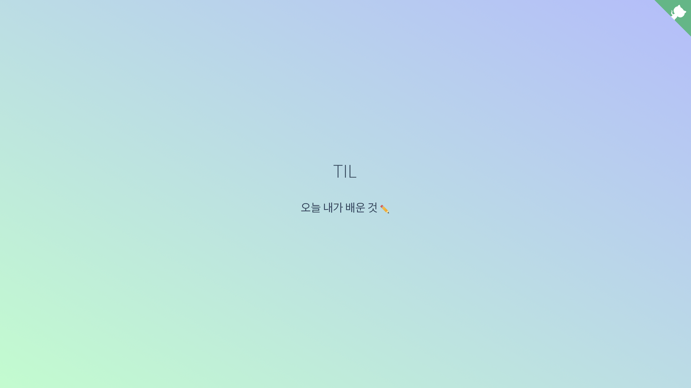

# 👩🏻‍💻 TIL
[](https://app.netlify.com/sites/todayejlearned/deploys)

This repository is for the things I learned today.

The website for this repo was generated by [docsify.js](https://docsify.js.org/#/) and deployed by [netlify](https://todayejlearned.netlify.com).

## Getting started

### Prerequisites

First, clone this repo.
```
git clone https://github.com/ejolie/TIL.git
```

### Install

It is recommended to install `docsify-cli` globally, which helps initializing and previewing the website locally.
```bash
npm i docsify-cli -g
```

## Preview
Change directory to `docs/` directory and run the local server with `docsify serve`.

You can preview your site in your browser on `http://localhost:3000`.

```bash
cd docs
docsify serve docs
```

## Deployment
I recommend you to read an official document of [docsify.js](https://docsify.js.org/#/deploy).

You can deploy files to GitHub Pages, Netlify, etc.

## Screenshot


