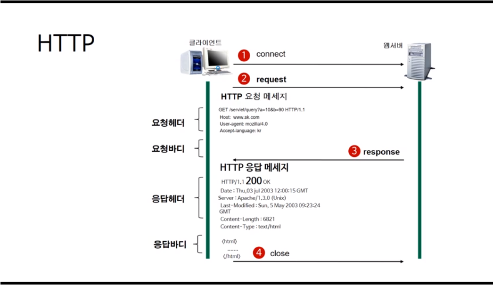

2019년 4월 22일 월요일

# HTTP 프로토콜이란?

## 인터넷(네트워크 통신)의 이해

### 인터넷 != WWW(World Wide Web)

WWW는 인터넷 기반 대표 서비스 중 하나

- 인터넷 서비스
  - WWW : 웹 서비스, HTTP, 80
  - Email : 이메일 서비스
  - FTP : 파일 전송 서비스
  - DNS : 네임 서비스 
  - NEWS : 인터넷 뉴스 서비스

### 인터넷

TCP/IP 기반의 네트워크가 전세계적으로 확대되어 하나로 연결된 네트워크들의 네트워크 (네트워크의 결합체)


## HTTP(Hypter Transfer Protocol)란?

- 팀 버너스리(Tim Berners-Lee)와 그가 속한 팀은 CERN에서 HTML뿐만 아니라 웹 브라우저 및 웹 브라우저 관련 기술과 HTTP를 발명

- 문서화된 최초의 HTTP버전은 HTTP v0.9(1991년)

- HTTP는 서버와 클라이언트가 인터넷상에서 데이터를 주고받기 위한 프로토콜(protocol)

- 현재 HTTP/2 버전
 

## HTTP 작동방식

HTTP는 서버/클라이언트 모델을 따른다. 클라이언트가 서버에게 요청을 보내고 이 요청을 받은 서버가 클라이언트에게 응답을 보낸다.

- 장점
  - 불특정 다수를 대상으로 하는 서비스에는 적합하다.
  - 클라이언트와 서버가 계속 연결된 형태가 아니기 때문에 클라이언트와 서버 간의 최대 연결 수보다 훨씬 많은 요청과 응답을 처리할 수 있다.

- 단점
  - 연결을 끊어버리기 때문에, 클라이언트의 이전 상황을 알 수가 없다. 즉, **무상태(Stateless)** 프로토콜이다.
  - 이러한 특징 때문에 정보를 유지하기 위해서 **Cookie**와 같은 기술이 등장하게 되었다.
  - 주고 받는 데이터가 암호화되지 않은 평문으로 전송되기 때문에 쉽게 정보가 노출될 수 있다.
  > HTTPS
  >
  > SSL(Secure Socker Layer) : 인터넷 서비스 제공자가 운영하는 서버와의 통신을 암호화해서 통신하는 규약
  >
  > SSL을 적용한 것이 HTTPS이다. 따라서 HTTP를 이용하면 데이터를 암호화하여 전송하므로 암호화된 보안 연결을 할 수 있다.

## URL(Uniform Resource Locator)

- 인터넷 상의 자원의 위치

- 특정 웹 서버의 특정 파일에 접근하기 위한 경로 혹은 주소

- 형태
1. 프로토콜의 종류

2. 자원이 있는 서버의 IP 주소 또는 도메인 이름, 포트 번호

    - IP 주소 : 우리의 집 주소, 하나의 컴퓨터에 IP 주소 하나
    - 포트 : 집에 있는 각각의 방, 한 방에 하나의 서버만 

    > 정리
    >
    > 하나의 물리적 컴퓨터에는 여러 개의 소프트웨어 서버가 동작할 수 있는데 이 서버는 포트 값(0보다 큰 숫자 값)이 다르게 동작해야 한다.

3. 자원의 위치

`접근 프로토콜`://`IP 주소 또는 도메인 이름`/`문서의 경로`/`문서 이름`

```
https://www.sunnyvale.co.kr/docs/index.html
```

## HTTP 요청



클라이언트가 먼저 원하는 서버에 접속을 한 뒤 서버에게 요청을 한다.

서버는 클라이언트가 접속해서 요청을 하면 이때 요청에 따른 응답 결과를 클라이언트에게 응답해준다.

이 응답이 끝나고 나면 서버와 클라이언트의 연결은 끊긴다. -> 무상태 (Stateless)

### 요청 메시지

요청 메시지는 1. 요청 헤더, 2. 빈 줄, 3. 요청 바디로 구성된다. 요청 헤더에는 요청 메서드, 요청 URI, HTTP 프로토콜 버전 + 여러 줄의 헤더 정보가 담긴다.

GET 방식은 요청할 때 가지고 가야하는 자원을 URI에 붙여서 가기 때문에 요청 바디가 존재하지 않는다.

POST나 PUT 방식을 사용하면 요청 바디가 필요하다.

### 요청 헤더
```http
GET /servlet/query?a=10&b=90 HTTP/1.1
Host: www.ek.com
User-agent: mozilla/4.0
Accept-language: kr
```

- 첫 번째 줄 : 요청 메서드, 요청 URI, HTTP 프로토콜 버전
- 두 번째 줄부터 : 여러 줄의 헤더 정보

#### 1) 요청 메서드
- **GET** : 정보를 요청 (SELECT)
- **POST** : 정보를 갱신 (UPDATE)
- **PUT** : 정보를 삽입 (INSERT)
- **DELETE** : 정보를 삭제 (DELETE)
- HEAD : (HTTP) 헤더 정보만 요청. 해당 자원이 존재하는지 혹은 서버에 문제가 없는지를 확인하기 위해서 사용
- OPTIONS : 웹 서버가 지원하는 메서드의 종류를 요청
- TRACE : 클라이언트의 요청을 그대로 반환. 예컨대 echo 서비스로 서버 상태를 확인하기 위한 목적으로 주로 사용

#### 2) 요청 URI
요청하는 자원의 위치를 명시

#### 3) HTTP 프로토콜 버전
웹 브라우저가 사용하는 프로토콜 버전

#### 4) 나머지 헤더 정보


### 응답 메시지

응답 메시지도 요청 메시지 포맷과 마찬가지로 1. 응답 헤더, 2. 빈 줄, 3. 응답 바디(html 파일 등 실제 응답 리소스 데이터)로 구성된다.

### 응답 헤더

```http
HTTP/1.1 200 OK
Date:
Server:
Last-Modified:
Content-Length: 6821
Content-Type: text/html
```

#### 1) 응답 HTTP 프로토콜의 버전

#### 2) 응답 코드

#### 3) 응답 메시지

#### 4) 나머지 정보


출처 : [부스트코스] 웹 프로그래밍